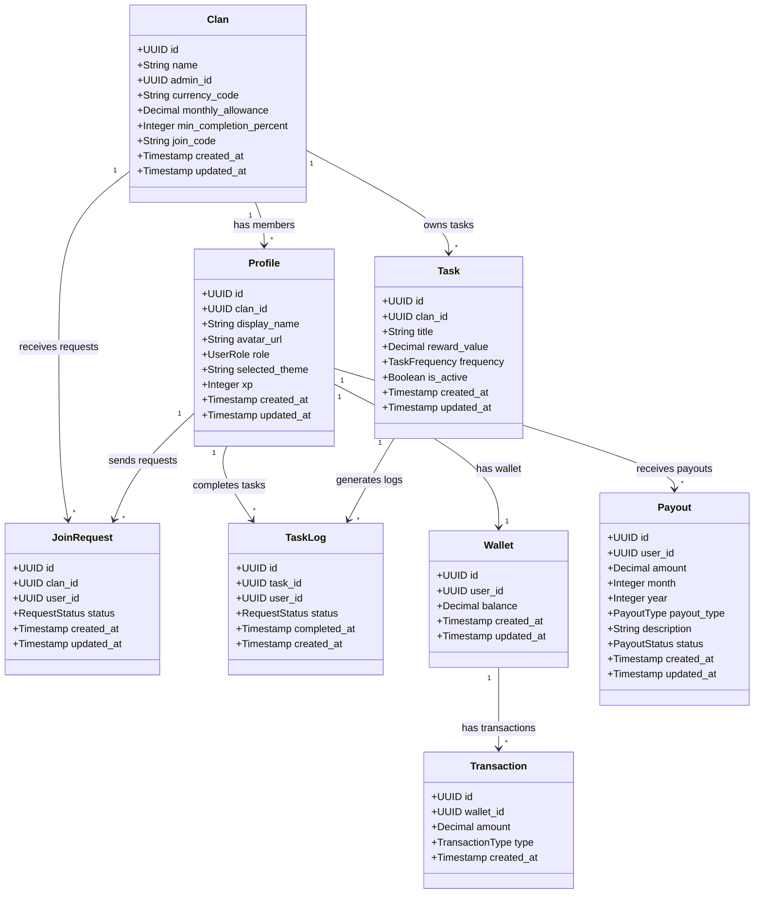
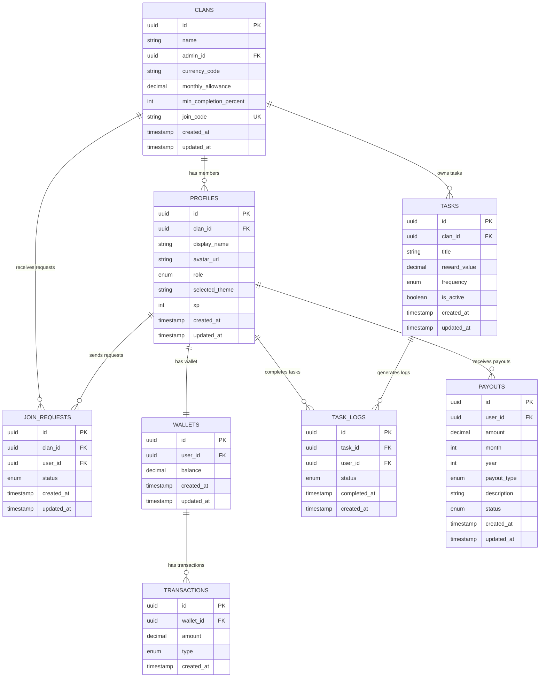
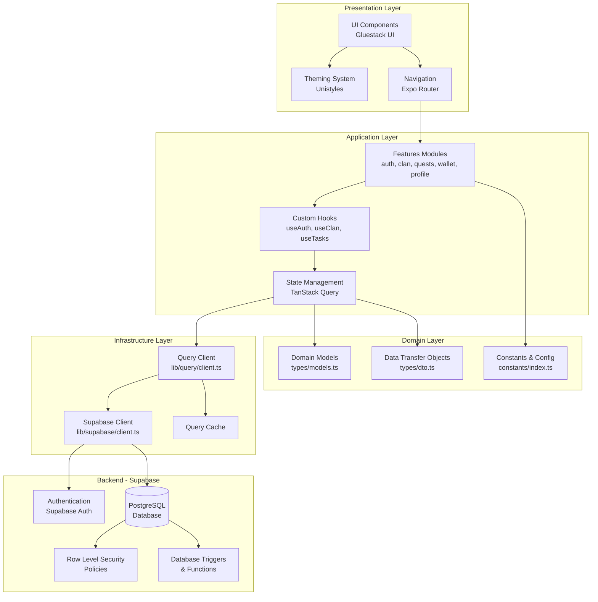
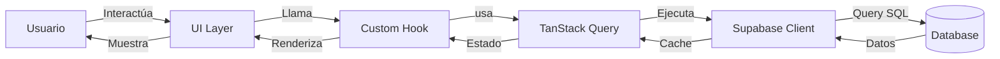

# Diagramas de Arquitectura - Clan Finance

## Diagrama UML de Clases



## Diagrama ER (Entidad-Relación)



## Diagrama de Arquitectura de Capas



## Diagrama de Flujo de Datos



## Diagrama de Componentes

```mermaid
graph TB
    subgraph "Mobile App"
        App[App Entry Point<br/>app/_layout.tsx]

        subgraph "Routes"
            Auth[Auth Routes<br/>(auth)/]
            Tabs[Tab Routes<br/>(tabs)/]
        end

        subgraph "Features"
            AuthFeature[Auth Feature]
            ClanFeature[Clan Feature]
            QuestsFeature[Quests Feature]
            WalletFeature[Wallet Feature]
            ProfileFeature[Profile Feature]
        end

        subgraph "Shared"
            UIComponents[UI Components]
            LayoutComponents[Layout Components]
            ThemeSystem[Theme System]
        end

        subgraph "Services"
            SupabaseService[Supabase Service]
            QueryService[Query Service]
            NotificationService[Notification Service]
        end
    end

    App --> Auth
    App --> Tabs
    Auth --> AuthFeature
    Tabs --> ClanFeature
    Tabs --> QuestsFeature
    Tabs --> WalletFeature
    Tabs --> ProfileFeature

    AuthFeature --> UIComponents
    ClanFeature --> UIComponents
    QuestsFeature --> UIComponents
    WalletFeature --> UIComponents
    ProfileFeature --> UIComponents

    UIComponents --> ThemeSystem

    AuthFeature --> SupabaseService
    ClanFeature --> QueryService
    QuestsFeature --> QueryService
    WalletFeature --> QueryService
    ProfileFeature --> QueryService

    QueryService --> SupabaseService
```

---

## Leyenda

### Tipos de Relaciones

- `-->` : Dependencia / Usa
- `||--o{` : Uno a muchos
- `||--||` : Uno a uno

### Cardinalidades

- `1` : Exactamente uno
- `*` : Cero o muchos
- `o{` : Cero o muchos
- `||` : Exactamente uno

### Tipos de Nodos

- **Rectángulo**: Clase / Componente
- **Cilindro**: Base de datos
- **Rombo**: Decisión
- **Círculo**: Inicio/Fin
