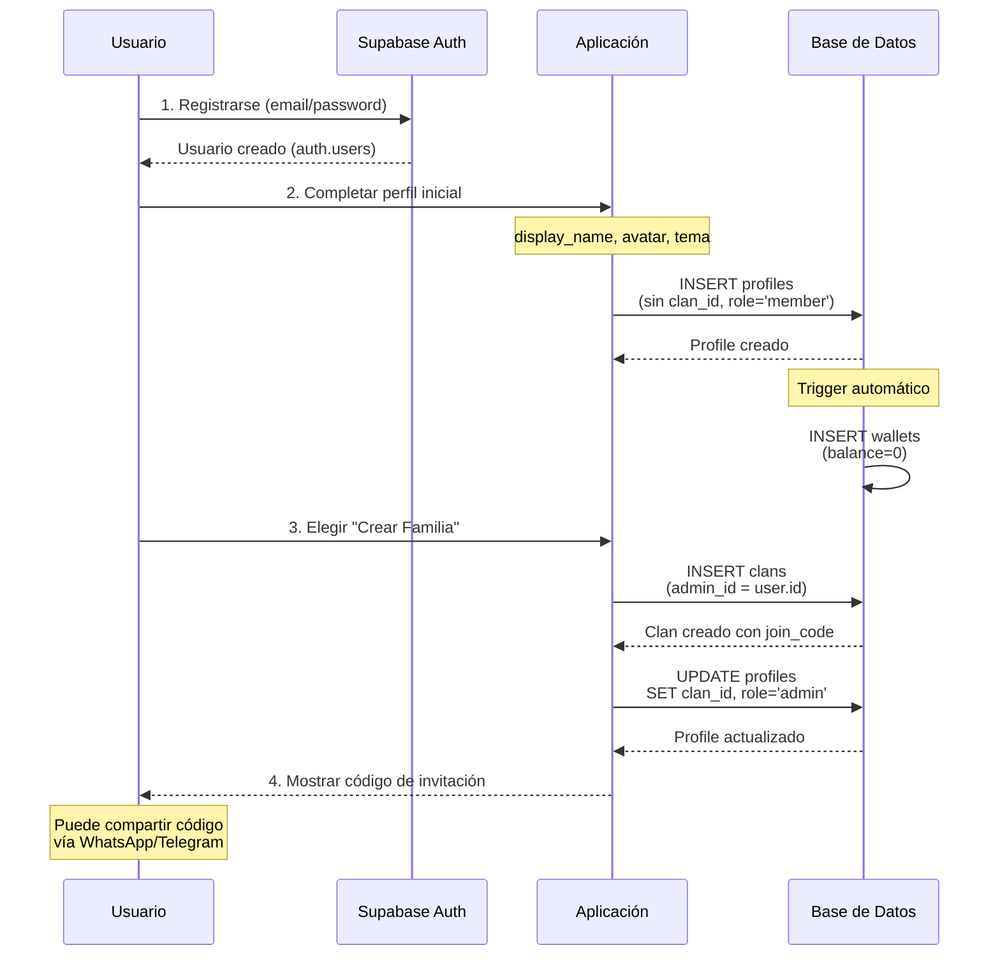
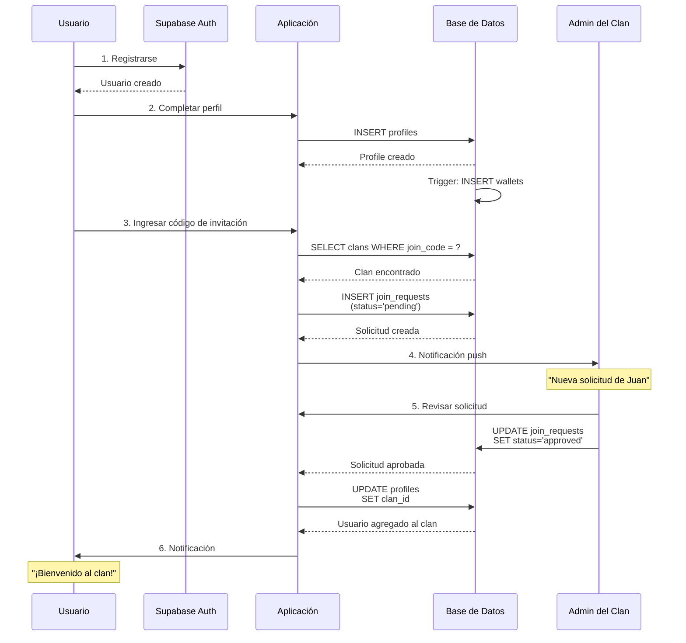
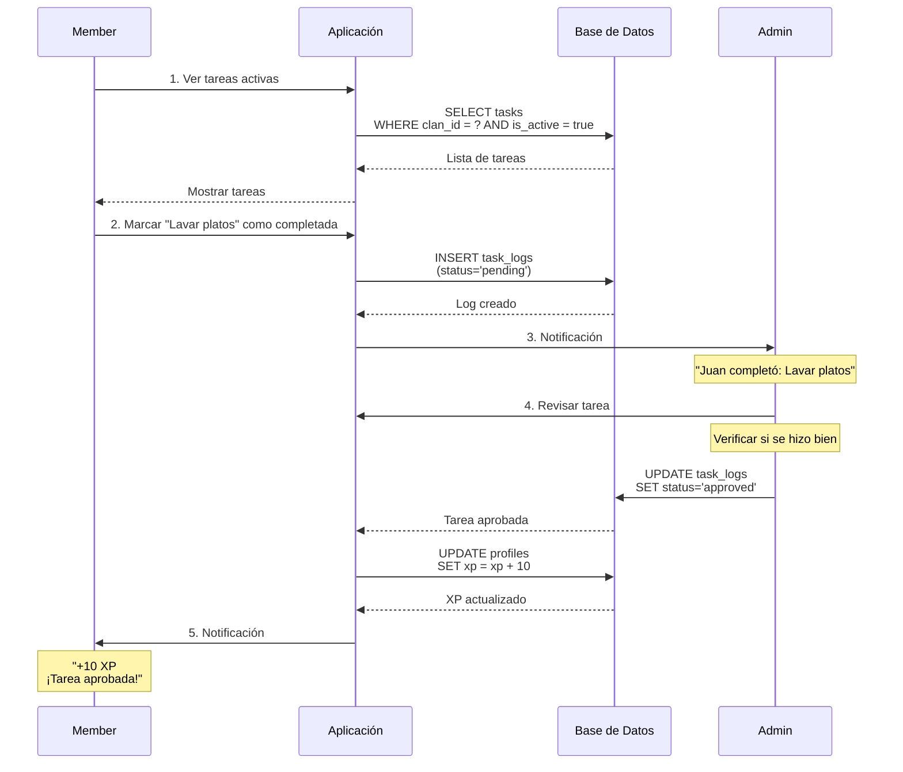
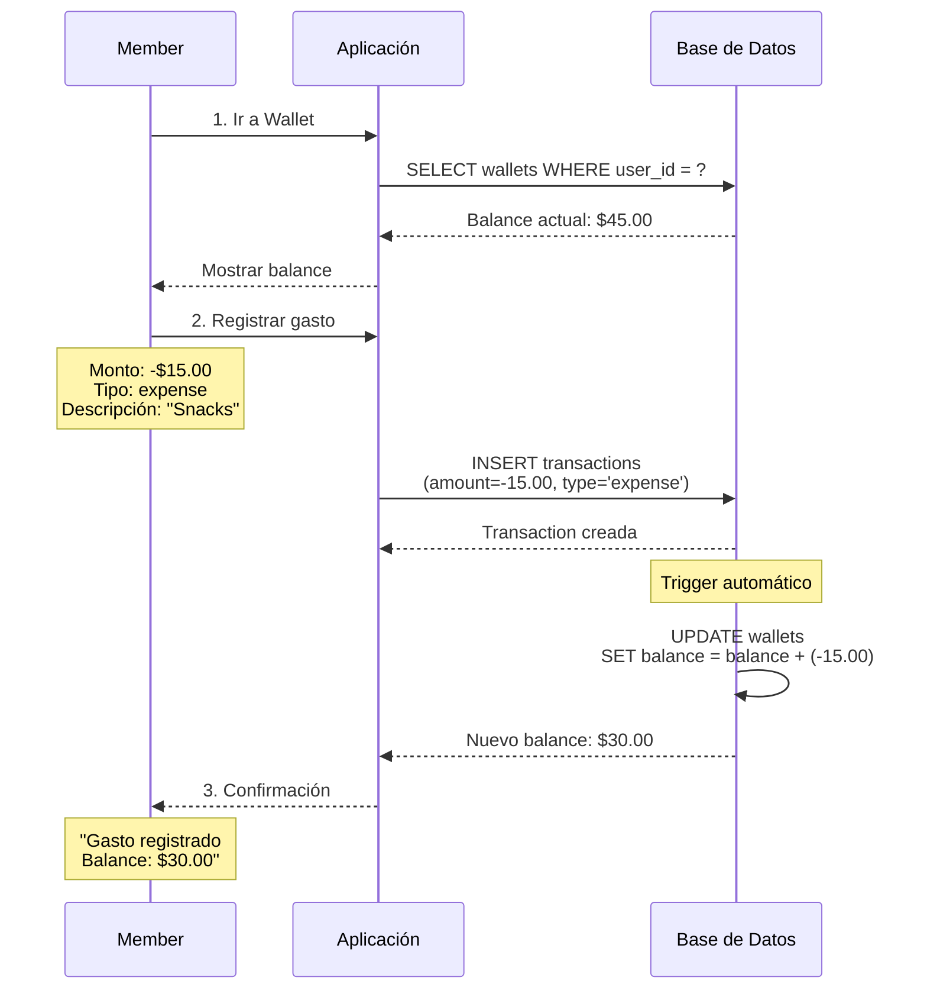
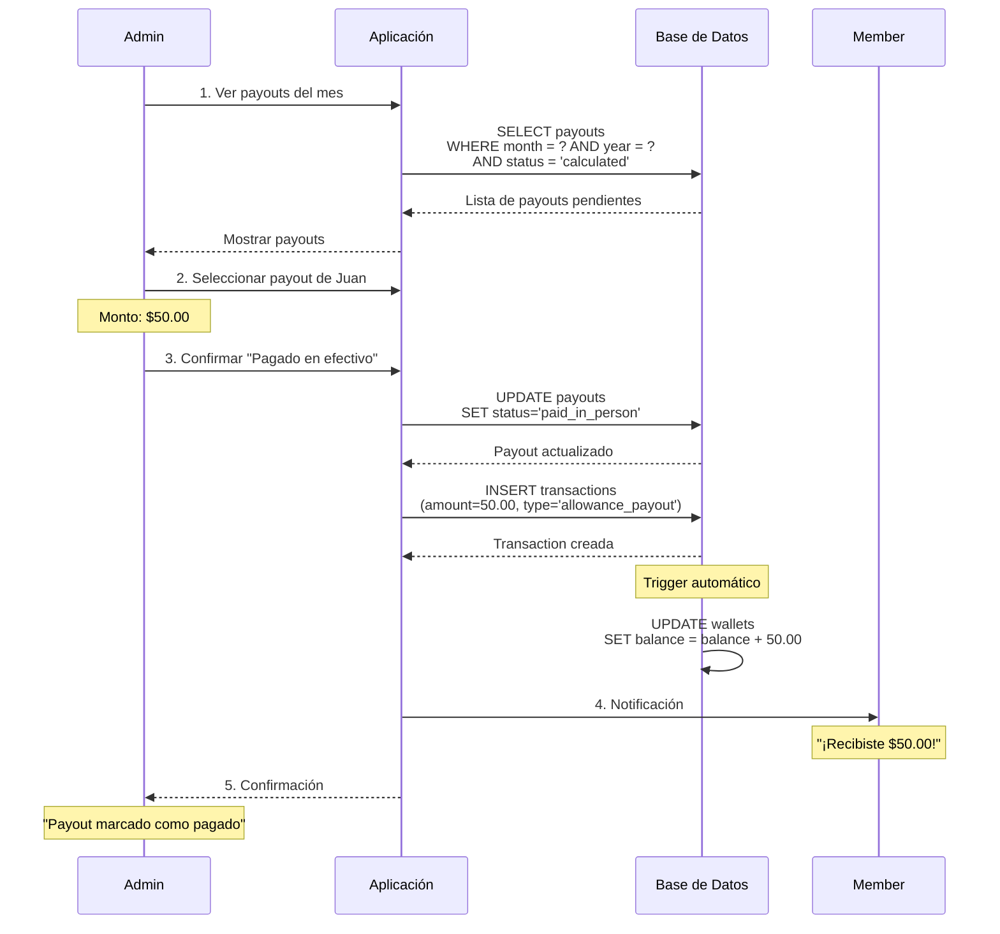
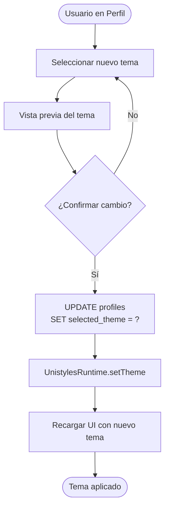
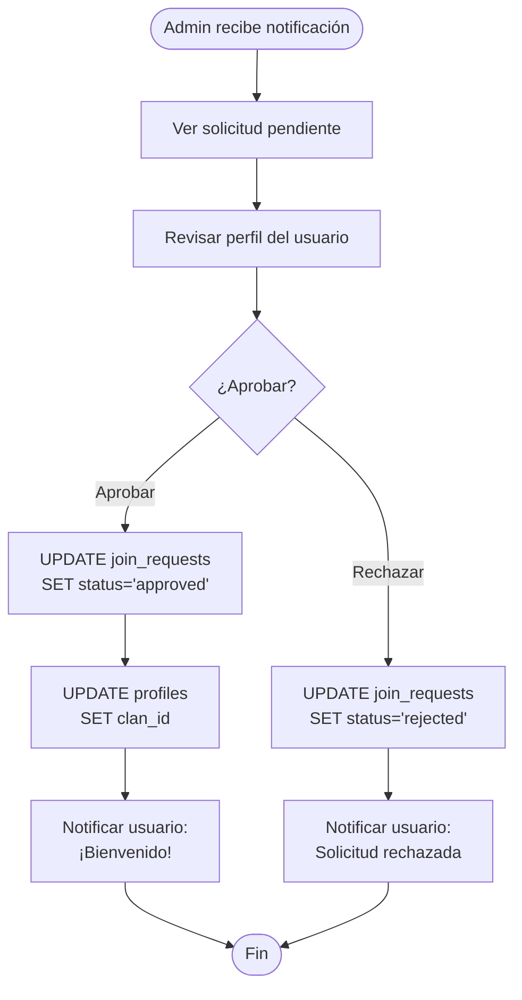
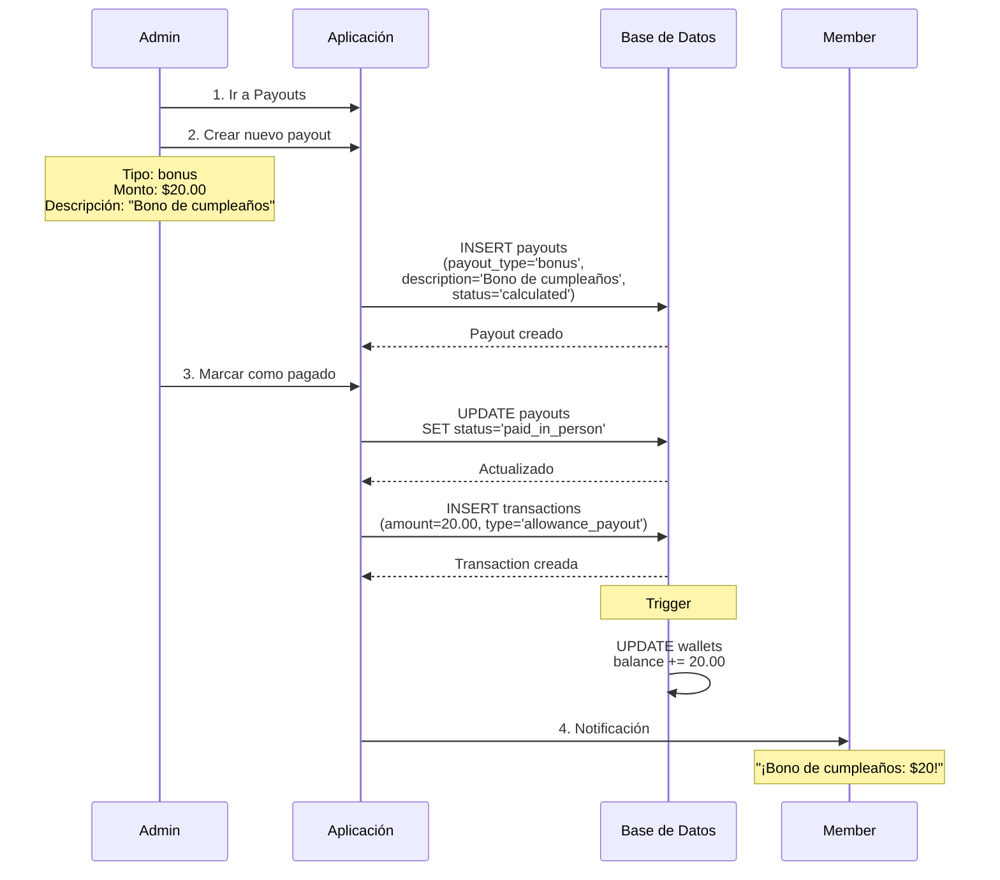

# Flujos de Casos de Uso - Clan Finance

## Flujo 1: Onboarding - Crear Familia



## Flujo 2: Onboarding - Unirse con Código



## Flujo 3: Completar Tarea



## Flujo 4: Cálculo de Payout Mensual

```mermaid
flowchart TD
    Start([Fin de Mes]) --> GetMembers[Obtener miembros del clan]
    GetMembers --> ForEach{Para cada miembro}

    ForEach -->|Siguiente| CountTasks[Contar tareas activas del mes]
    CountTasks --> CountCompleted[Contar tareas completadas<br/>status='approved']
    CountCompleted --> CalcPercent[Calcular % completado]

    CalcPercent --> CheckPercent{% >= min_completion_percent?}
    CheckPercent -->|Sí| FullPayout[Payout = monthly_allowance]
    CheckPercent -->|No| PartialPayout[Payout = monthly_allowance * %]

    FullPayout --> CreatePayout[INSERT payout<br/>payout_type='monthly_allowance'<br/>status='calculated']
    PartialPayout --> CreatePayout

    CreatePayout --> ForEach
    ForEach -->|Fin| NotifyAdmin[Notificar Admin:<br/>"Payouts calculados"]
    NotifyAdmin --> End([Fin])
```

## Flujo 5: Registrar Gasto



## Flujo 6: Marcar Payout como Pagado



## Flujo 7: Cambiar Tema (Skin)



## Flujo 8: Aprobar Solicitud de Unión



## Flujo 9: Crear Bono Especial



---

## Notas Importantes

### Triggers Automáticos

- **Crear wallet**: Al insertar profile, se crea wallet automáticamente
- **Actualizar balance**: Al insertar transaction, el balance se actualiza automáticamente
- **Updated_at**: Todas las tablas actualizan `updated_at` automáticamente

### Notificaciones

- Implementadas con Expo Notifications
- Push notifications para eventos importantes
- Notificaciones locales para recordatorios diarios

### Validaciones

- RLS policies validan permisos en cada operación
- Constraints de BD validan integridad de datos
- Validaciones de negocio en la aplicación
